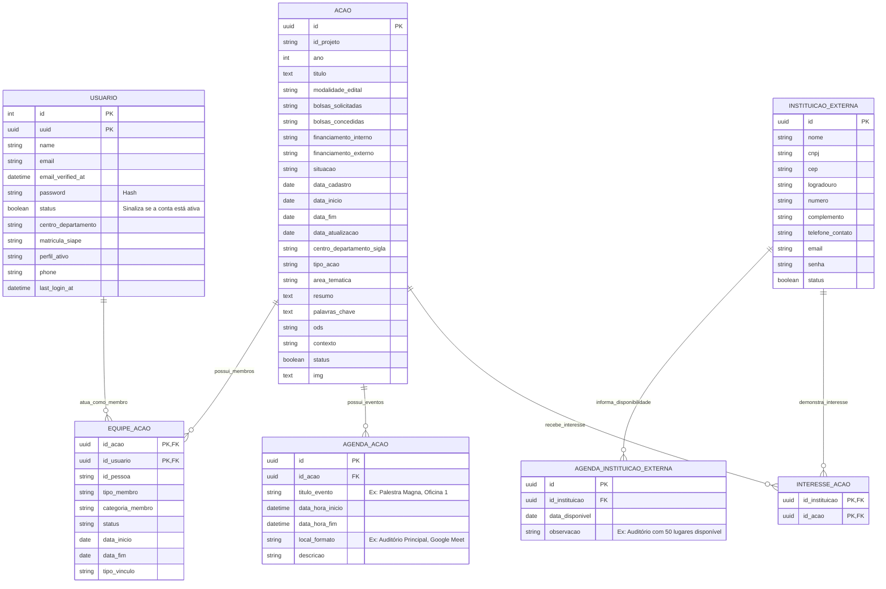
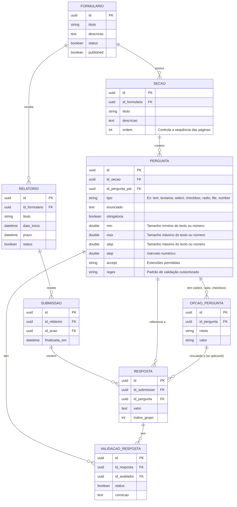

## Diagrama de Banco de Dados (ER) - Parte 1

Abaixo está o modelo Entidade-Relacionamento das tabelas da primeira parte do sistema, ilustrando como usuários, ações e instituições se conectam.



## Diagrama de Banco de Dados (ER) - Parte 2

Abaixo está o modelo Entidade-Relacionamento das tabelas da segunda parte do sistema, ilustrando como irá funcionar o mini forms.


---

## Referência da API

### Listar Ações
Retorna todas as ações cadastradas no sistema com paginação.

```http
GET /api/acoes
```

### Filtrar Ações
Você pode passar parâmetros na URL (Query Params) para filtrar os resultados. Ideal para barras de pesquisa e filtros no front-end.

**Filtro Simples (Ex: por área temática)**
```http
GET /api/acoes?area_tematica=trabalho
```

**Filtros Combinados**
```http
GET /api/acoes?area_tematica=comunicacao&titulo=teste&modalidade=teste&centro_departamento=teste
```

---

## Deploy no Coolify

Use o arquivo `docker-compose.prod.yml` com o build pack `Docker Compose`.

Serviços do stack:

- `nginx`: serviço HTTP público na porta `80`
- `app`: PHP-FPM com bootstrap do Laravel
- `worker`: processamento das filas
- `db`: MySQL com volume persistente
- `redis`: Redis com volume persistente

O serviço `app` executa `php artisan migrate --force` no bootstrap quando `RUN_MIGRATIONS=true`.

Variáveis mínimas no Coolify:

```env
APP_KEY=base64:gere-uma-chave-valida
APP_URL=https://seu-dominio.example.com
DB_DATABASE=sigex
DB_USERNAME=sigex
DB_PASSWORD=troque-isto
DB_ROOT_PASSWORD=troque-isto-tambem
```

Para produção, mantenha:

```env
APP_ENV=production
APP_DEBUG=false
LOG_CHANNEL=stderr
DB_HOST=db
REDIS_HOST=redis
QUEUE_CONNECTION=database
SESSION_DRIVER=database
CACHE_STORE=database
RUN_MIGRATIONS=true
```
