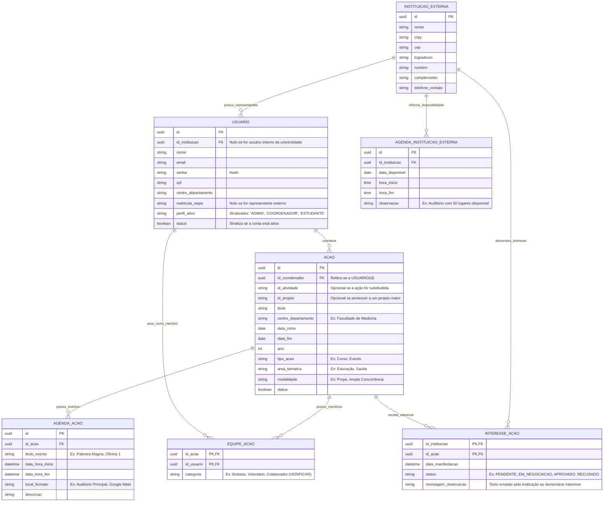

### ER das prmeiras tabelas

```mermaid
erDiagram
    USUARIO ||--o{ ACAO : "coordena"
    ACAO ||--o{ EQUIPE_ACAO : "possui_membros"
    USUARIO ||--o{ EQUIPE_ACAO : "atua_como_membro"
    INSTITUICAO_EXTERNA ||--o{ USUARIO : "possui_representantes"

    ACAO ||--o{ AGENDA_ACAO : "possui_eventos"
    INSTITUICAO_EXTERNA ||--o{ AGENDA_INSTITUICAO_EXTERNA : "informa_disponibilidade"
    INSTITUICAO_EXTERNA ||--o{ INTERESSE_ACAO : "demonstra_interesse"
    ACAO ||--o{ INTERESSE_ACAO : "recebe_interesse"

    INSTITUICAO_EXTERNA {
        uuid id PK
        string nome
        string cnpj
        string cep
        string logradouro
        string numero
        string complemento
        string telefone_contato
    }

    ACAO {
        uuid id PK
        uuid id_coordenador FK "Refere-se a USUARIO(id)"
        string id_atividade "Opcional se a ação for subdividida"
        string id_projeto "Opcional se pertencer a um projeto maior"
        string titulo
        string centro_departamento "Ex: Faculdade de Medicina"
        date data_inicio
        date data_fim
        int ano
        string tipo_acao "Ex: Curso, Evento"
        string area_tematica "Ex: Educação, Saúde"
        string modalidade "Ex: Prope, Ampla Concorrência"
        boolean status
    }

    EQUIPE_ACAO {
        uuid id_acao PK, FK
        uuid id_usuario PK, FK
        string categoria "Ex: Bolsista, Voluntário, Colaborador (VERIFICAR)"
    }

    USUARIO {
        uuid id PK
        uuid id_instituicao FK "Nulo se for usuário interno da universidade"
        string nome
        string email
        string senha "Hash"
        string cpf
        string centro_departamento
        string matricula_siape "Nulo se for representante externo"
        string perfil_ativo "Sinalizador: 'ADMIN', 'COORDENADOR', 'ESTUDANTE'"
        boolean status "Sinaliza se a conta está ativa"
    }

    AGENDA_ACAO {
        uuid id PK
        uuid id_acao FK
        string titulo_evento "Ex: Palestra Magna, Oficina 1"
        datetime data_hora_inicio
        datetime data_hora_fim
        string local_formato "Ex: Auditório Principal, Google Meet"
        string descricao
    }

    AGENDA_INSTITUICAO_EXTERNA {
        uuid id PK
        uuid id_instituicao FK
        date data_disponivel
        time hora_inicio
        time hora_fim
        string observacao "Ex: Auditório com 50 lugares disponível"
    }

    INTERESSE_ACAO {
        uuid id_instituicao PK, FK
        uuid id_acao PK, FK
        datetime data_manifestacao
        string status "Ex: PENDENTE, EM_NEGOCIACAO, APROVADO, RECUSADO"
        string mensagem_observacao "Texto enviado pela instituição ao demonstrar interesse"
    }
```