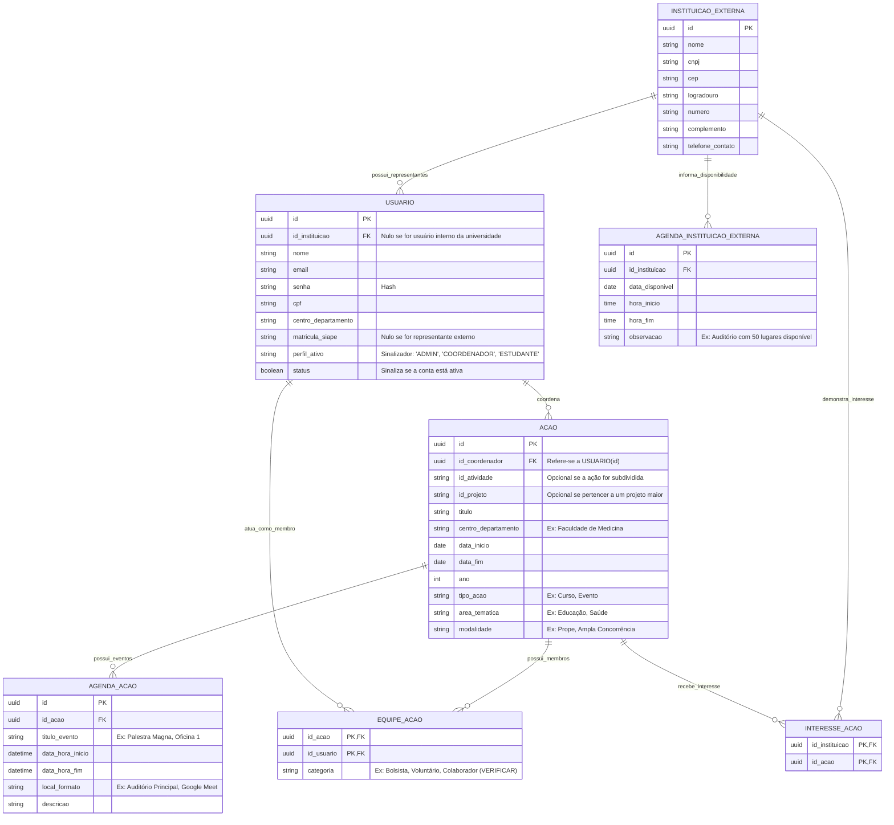

# 🚀 Projeto Laravel com Docker

Este projeto utiliza Docker para criar um ambiente de desenvolvimento Laravel completo, com os seguintes serviços:

- PHP (com Laravel)
- MySQL
- Nginx
- Redis (opcional)
- phpMyAdmin

## 📦 Requisitos

- [Docker](https://www.docker.com/)
- [Docker Compose](https://docs.docker.com/compose/)
- Laravel já configurado no diretório do projeto

## ⚙️ Configuração inicial

### 1. Clonar o repositório

```bash
git clone https://github.com/Otavio-Ferreira/Docker-Laravel.git
````

### 2. Copiar o `.env`

Se ainda não tiver um `.env`, copie:

```bash
cp .env.example .env
```

E ajuste as seguintes variáveis de conexão com o banco de dados:

```env
DB_CONNECTION=mysql
DB_HOST=db
DB_PORT=3306
DB_DATABASE=docker-laravel
DB_USERNAME=phpmyadmin
DB_PASSWORD=root
```

### 3. Criar os containers

```bash
sudo docker-compose up -d --build
```

Este comando irá:

* Criar os containers definidos no `docker-compose.yml`
* Instalar dependências PHP no container
* Levantar o ambiente completo

### 4. Acessar o container da aplicação

```bash
sudo docker-compose exec app bash
```

### 5. Instalar dependências PHP (dentro do container)

```bash
composer install
```

### 6. Rodar comandos Artisan (dentro do container)

```bash
php artisan key:generate
```
```bash
php artisan migrate --seed
```

### 7. Instalar dependências JS (caso use frontend)

```bash
npm install && npm run dev
```

### 8. Rodar os testes (se houver)

```bash
php artisan test
```

## 🔍 Acessos úteis

* Aplicação Laravel: [http://localhost:8000](http://localhost:8000)
* phpMyAdmin: [http://localhost:8080](http://localhost:8080)

  * Servidor: `db`
  * Usuário: `phpmyadmin`
  * Senha: `root`

## ✅ Checklist ao levantar o ambiente

* [x] Subiu os containers com `docker-compose up -d`
* [x] Acessou o container com `docker-compose exec app bash`
* [x] Rodou `composer install`
* [x] Rodou `php artisan key:generate`
* [x] Rodou `php artisan migrate`
* [x] Verificou o site em [http://localhost:8000](http://localhost:8000)


# Docker - Comandos úteis

Aqui estão os principais comandos Docker e `docker-compose` para gerenciar seu ambiente Laravel:

---

### 🔨 Buildar os containers (construir imagens)

```bash
sudo docker-compose build
````

Esse comando **reconstrói as imagens** com base nas instruções do `Dockerfile`, sem subir os containers.

---

### 🚀 Subir os containers

```bash
sudo docker-compose up -d
```

`-d` significa "detached", ou seja, roda em segundo plano. Usa o `docker-compose.yml` para levantar todos os serviços definidos.

> Dica: combine com `--build` se quiser buildar e subir ao mesmo tempo:

```bash
sudo docker-compose up -d --build
```

---

### 🛑 Parar os containers (sem remover)

```bash
sudo docker-compose stop
```

Isso apenas pausa os containers, mantendo-os disponíveis para restart.

---

### ▶️ Iniciar os containers que estão parados

```bash
sudo docker-compose start
```

Reinicia os containers que foram pausados com `stop`.

---

### ❌ Parar e remover todos os containers


```bash
sudo docker-compose down
```

Remove os containers criados, mas mantém as imagens, volumes e redes (a menos que você diga o contrário).

---

### ❌🧹 Parar e remover containers + volumes + redes

```bash
sudo docker-compose down -v --remove-orphans
```

`-v`: remove volumes (ex: banco de dados) `--remove-orphans`: remove containers que não estão mais no `docker-compose.yml`

> Use com cuidado, pois **apaga dados persistentes** como banco MySQL se estiver usando volumes locais.

---

### 🐚 Acessar o terminal dentro do container da aplicação Laravel

```bash
sudo docker-compose exec app bash
```

Depois de entrar, você pode rodar comandos PHP/Artisan, por exemplo:

```bash
php artisan migrate
```

---

### 📦 Ver containers em execução

```bash
sudo docker ps
```

---

### 🔍 Ver todos os containers (mesmo os parados)

```bash
sudo docker ps -a
```

---

### 🗑️ Remover containers parados

```bash
sudo docker container prune
```

---

### 🗑️ Remover imagens que não estão sendo usadas

```bash
sudo docker image prune
```

### ER das prmeiras tabelas

